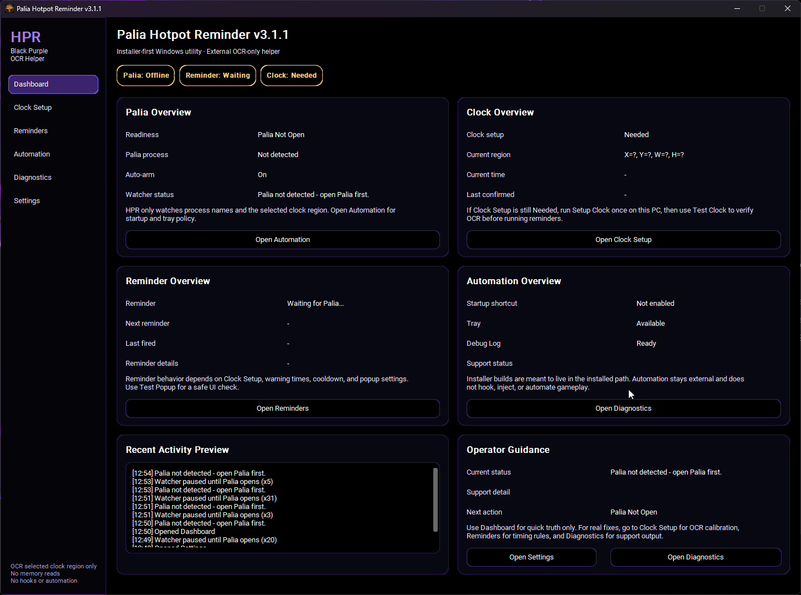
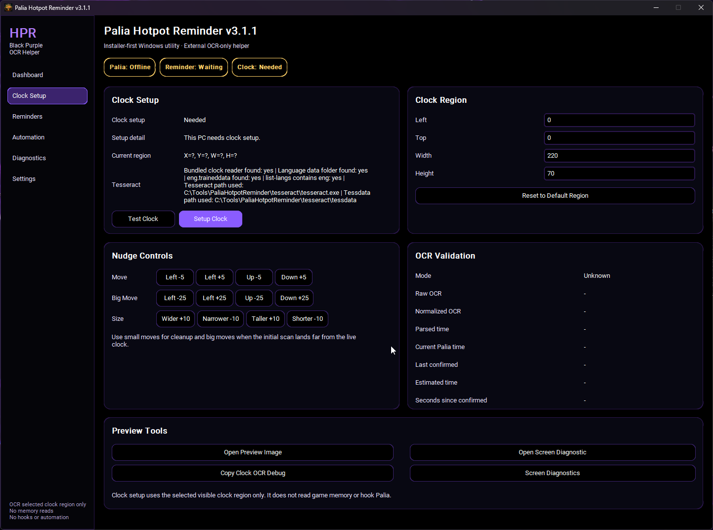
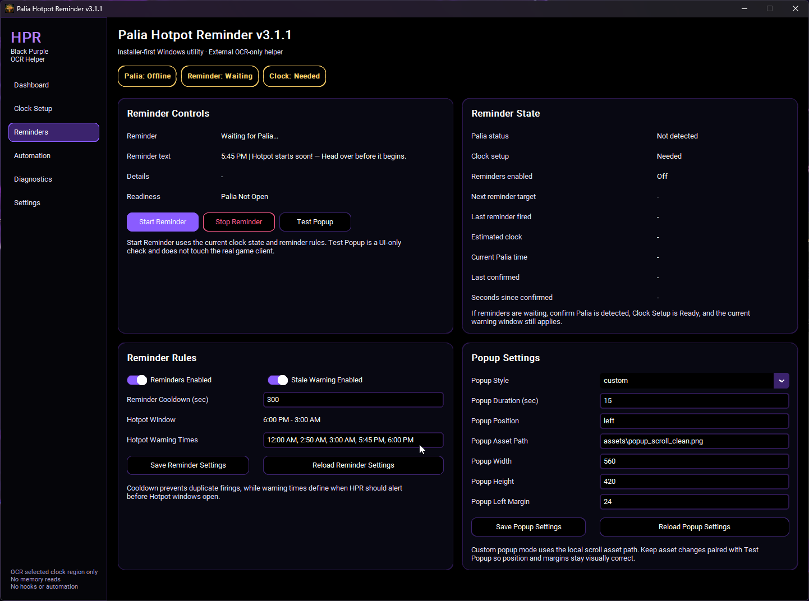
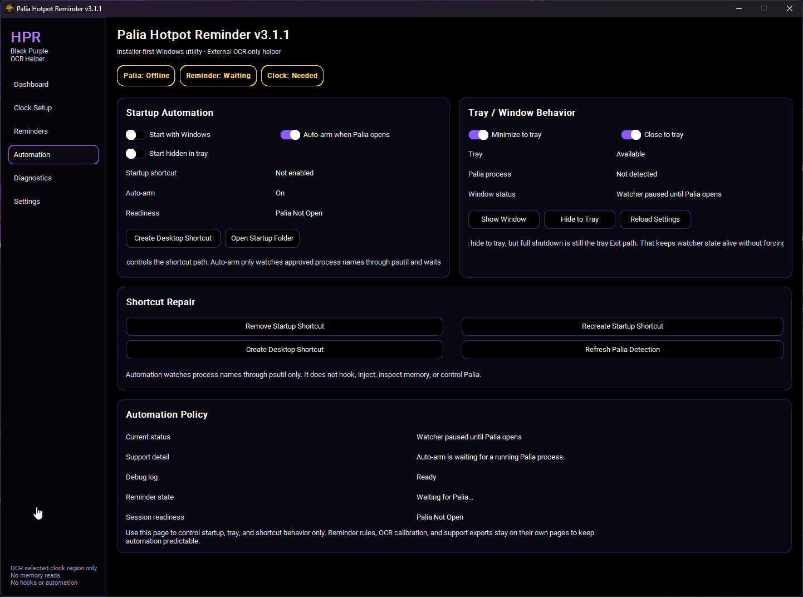
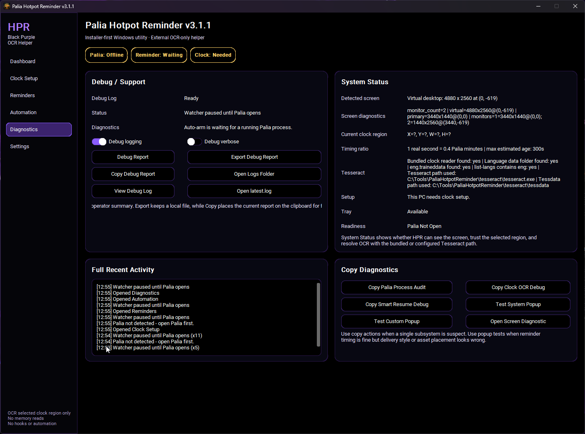
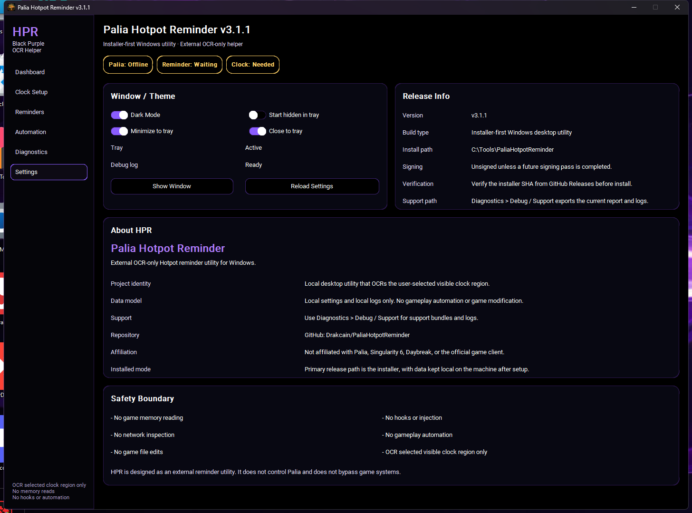

# PaliaHotpotReminder


PaliaHotpotReminder is an installed Windows reminder utility for Palia Hotpot. It uses safe screen OCR on a user-selected clock region so it can track the in-game time and fire reminder popups without modifying the game.

## What It Is

PaliaHotpotReminder is a local desktop helper app. It is not a Palia mod, overlay, bot, memory reader, network tool, or gameplay automation tool.

Users download one file from GitHub Releases:

```text
PaliaHotpotReminder-Setup-v3.1.3.exe
```

No manual folder copying is required.

## Current Version
- `v3.1.3`
- Primary artifact: `PaliaHotpotReminder-Setup-v3.1.3.exe`
- Install path: `C:\Tools\PaliaHotpotReminder`
- Run target: `C:\Tools\PaliaHotpotReminder\Hotpot-Remind.exe`

## How It Works
- Lets the user select the visible Palia clock region once with `Setup Clock`.
- OCRs only that selected clock area on screen.
- Tracks current Hotpot timing state.
- Shows reminder popups for configured Hotpot times.
- Supports tray behavior, startup options, Smart Resume, and safe local recall.
- Stays single-instance so duplicate launches do not stack.

## Screenshots

The screenshots below show the fixed-window v3.1.3 interface and the six main HPR pages.

| Dashboard | Clock Setup |
|---|---|
|  |  |

| Reminders | Automation |
|---|---|
|  |  |

| Diagnostics | Settings |
|---|---|
|  |  |

## Install
1. Open the latest GitHub Release.
2. Download `PaliaHotpotReminder-Setup-v3.1.3.exe`.
3. Run it and approve the Windows administrator prompt.
4. Install to `C:\Tools\PaliaHotpotReminder`.
5. Launch **Palia Hotpot Reminder** from the Start Menu.
6. Open Palia.
7. Click `Setup Clock` once.
8. Click `Start Reminder`.
9. Optional: enable `Start with Windows` if you want HPR to open automatically.
10. Optional: keep `Auto-arm when Palia opens` enabled so HPR starts watching when Palia opens.

The EXE is currently unsigned. Windows SmartScreen may show **Windows protected your PC**. Select **More info**, verify that the file came from this repository's Releases page, and select **Run anyway**.

## Release Artifacts

Current releases publish:

```text
PaliaHotpotReminder-Setup-v3.1.3.exe
PaliaHotpotReminder-Setup-v3.1.3.exe.sha256
```

Portable ZIP files are not the normal release path.

## Installed Layout
```text
C:\Tools\PaliaHotpotReminder
├─ Hotpot-Remind.exe
├─ assets\
│  ├─ App Icon\
│  ├─ Branding\
│  └─ Message Board\
├─ config\
├─ tesseract\
├─ logs\
├─ debug\
└─ exports\
```

Runtime paths:

```text
C:\Tools\PaliaHotpotReminder\config\settings.json
C:\Tools\PaliaHotpotReminder\config\recall_state.json
C:\Tools\PaliaHotpotReminder\logs
C:\Tools\PaliaHotpotReminder\debug
C:\Tools\PaliaHotpotReminder\exports
```

The installer preserves existing user settings, safe recall state, logs, debug files, and exports during upgrades where possible.

## Tray Behavior
- `Close to tray` controls the X button.
- `Minimize to tray` controls the minimize button.
- `Show HPR` restores the window from tray.
- `Exit HPR` fully closes the app.

## Safety / TOS Boundary
- Does not modify Palia.
- Does not read game memory.
- Does not inject or hook.
- Does not inspect network traffic.
- Does not automate gameplay.
- Only OCRs the selected clock area on the user's screen.

## Troubleshooting
- Use `Debug / Support` for OCR checks, state inspection, and support exports.
- Review support bundles before sharing them publicly.
- `Test Clock` uses the same parser as the live reminder loop.
- If OCR is noisy, export a Debug Report for support.
- If the bundled clock reader is missing, reinstall using `PaliaHotpotReminder-Setup-v3.1.3.exe`.
- `config/settings.json` is local-only and should not be shared as source because it can contain personal clock-region setup.

## Repo Notes
- Tracked template config lives at `config/settings.example.json`.
- Local runtime config should stay untracked at `config/settings.json`.
- Local safe recall state should stay untracked at `config/recall_state.json`.
- Build and release artifacts belong in GitHub Releases, not normal source commits.

## Development
- Source code: `src/`
- Assets: `assets/`
  - App icon: `assets/App Icon/`
  - Repository branding: `assets/Branding/`
  - Popup/message board art: `assets/Message Board/`
- Installer build: `scripts/build_installer.ps1`
- Repo validation: `scripts/Test-Repo.ps1`
- Python packages used by the build/runtime:
  - `customtkinter`
  - `mss`
  - `pillow`
  - `pytesseract`
  - `winotify`
  - `pyinstaller`
  - `pystray`
  - `psutil`

Build from source:

```powershell
powershell.exe -NoProfile -ExecutionPolicy Bypass -File .\scripts\Test-Repo.ps1
powershell.exe -NoProfile -ExecutionPolicy Bypass -File .\scripts\build_installer.ps1
```

## Not Affiliated With Palia

This project is an external helper utility. It is not a Palia mod.
It is not affiliated with, authorized by, sponsored by, or endorsed by Palia, Singularity 6, or Daybreak Game Company.
